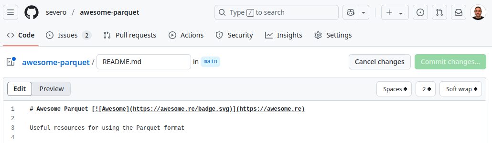
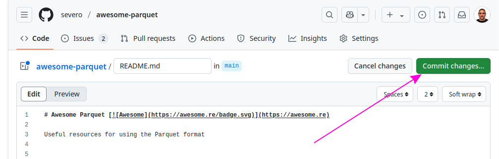
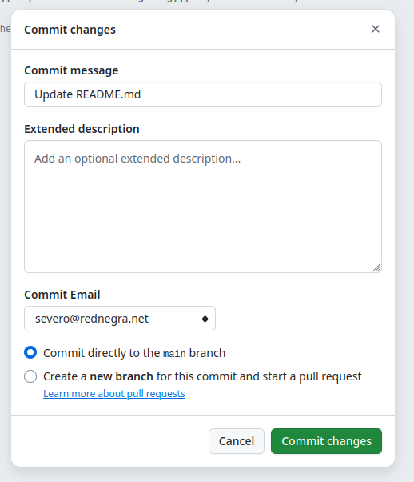

# Contribution Guidelines

Please note that this project is released with a [Contributor Code of Conduct](code-of-conduct.md). By participating in this project you agree to abide by its terms.

## Adding something to this awesome list

If you have something awesome to contribute to this awesome list, this is how you do it.

First, ensure that your addition meets the following criteria:

- Only awesome items. Awesome lists are curations of the best, not everything.
- Does not contain items that are unmaintained, has archived repo, deprecated, or missing docs.
- Entries have a description, unless the title is descriptive enough by itself. It rarely is though.
- The description is concise and informative, not just a link to the project.
- The description is in the same language as the title.
- The link and description are separated by a dash. Example: - [AVA](…) - JavaScript test runner.
- The description starts with an uppercase character and ends with a period.
- Consistent and correct naming. For example, Node.js, not NodeJS or node.js.

Now, to send your contribution, follow these steps:

You'll need a [GitHub account](https://github.com/join)!

1. Access the awesome list's GitHub page: https://github.com/severo/awesome-parquet
2. Now click on the `README.md` edit icon. 
3. You can start editing the text of the file in the in-browser editor. Make sure you follow the guidelines above. You can use [GitHub Flavored Markdown](https://help.github.com/articles/github-flavored-markdown/). 
4. Click "Commit changes..." 
5. Say why you're proposing the changes, and then click on "Commit changes". 
6. Submit the [Pull Request](https://help.github.com/articles/using-pull-requests/)!

## Updating your Pull Request

Sometimes, a maintainer of this awesome list will ask you to edit your Pull Request before it is included. This is normally due to spelling errors or because your PR didn't match the awesome list guidelines.

[Here](https://github.com/RichardLitt/knowledge/blob/master/github/amending-a-commit-guide.md) is a write up on how to change a Pull Request and the different ways you can do that.
